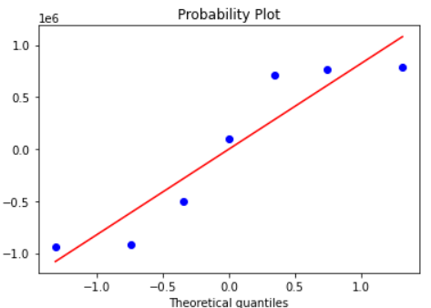

# Data-115

## Motivation
Throughout my life I have been extremely involved in the sports world, especially the game of baseball. Whether it be on the field or behind the scenes, I have always loved the intricacies of baseball above all others. My dream job is to one day become a data analysit for one of the 30 MLB franchises or even work in the MLB headquarters in New York City. The limitless bounds of this Personal Dataset Project has allowed me to bring this passion into the classroom. I have always wondered why some positions tend to get paid significantly more than others when their contributions are all important to the success of their team. In this project I hope to discover whether or not the statistical categories of Runs, RBI, Batting Average, On Base Percentage, and Slugging Percentage can predict the salaries of different positions in Major League Baseball.

## Sources of Data
In this project I have two excel files, one of which came straight from [rotowire.com](https://www.rotowire.com/baseball/stats.php), and includes the statistics for each MLB player in 2020 (excluding pitchers). I have included this raw data as mlb-player-stats-Batters.csv in this repository. I also researched the average salary for each position which did not come in a CSV, so I created one using the data on [spotrac.com](https://www.spotrac.com/mlb/positional/). This data is Positional-Salaries.csv in this repository. This is what I will use to test whether or not differences in salaries can be accounted for by main statistics.

## Data Proccessing
Fortunately for me, Major League Baseball does an amazing job of tracking statistics in a neat organized fashion and presenting them in a very readable manner. The raw data came formatted with each entry being one of the 613 players to step into the batters box in the regualer season in 2020. In order to avoid outliers from players who played an insignificant number of games this season, I first got rid of all players who played less than 10 games this past season. In a normal year most analysts only use data from player who played at least 50 games, but this season was only 60 games long, meaning very few players met the normal threshold. I then used  Excel's Pivot Table application in order to create a new position based spreadsheet. This new spreadsheet is indexed by each position, and includes that position's average Runs Scored, RBI, Batting Average, On Base Percentage, and Slugging Percentage. I then added a final column, which is the Average Salary earned by each position in 2020. It is key that when placing these salaries into the new spreadsheet to remove commas, or Python will read these lines as text not as numerical values, which will be key later on. The resulting spreadsheet is included in the repository as Averages-and-Salaries.csv, and is the spreadsheet that I am using for the rest of the analysis.

## Visualization
To begin my project, I decided to research whether or not there was actually a discripency in the way each position was being paid. To do this I created a simple boxplot revealing the average salary for each position. The resulting image showed how different each position was paid on average. At first glance we see that the Designated Hitter position is paid signficantly more than the rest. I believed that this must have to do with a difference in offensive statistics, so I set out on a way to find out what these may be.

## Analysis
Below is an image representing the linear regression model I fitted to the Positional-Salaries.csv that I created. I attempted to fit a regression line to the 5 statistical categories I believed are most important to an MLB player's success, at least from an offensive standpoint. This regression line estimated that over 94% of the average salary by position can be reflected in this position's average Runs Scored, RBI, Batting Average, On Base Percentage, and Slugging Percentage. The fit of the predicted model is reiterated in the second image which plots the predicted salaries against the actual average salaries, which shows a fairly linear relationship.

 

Although this regression model seems to fairly accurately estimate the average salary by position, I do not believe this would very accurately translate to a spreadsheet with individual players. Although this analysis fits the mean, it also implies that salary is negatively correlated with all of the key statistics except for Average RBI. This is a good predictor for the mean positional statistics, however logic will tell us this may not be the best regressional model to use when predicting how much money an athlete should be paid in a given season. This regression model tells us that although these statistics may be very popular in debating skill level, they do not accurately predict the monetary value of an MLB athlete.

## Conclusion
Overall, my linear regression model is fairly accurate in descrbing the expected average salaries for each position group. 94% explanation will allow teams a fairly accurate idea of what they should be paying each position group as a whole, even though it may not be the best for each individual player. Although this regression model may not be representative of each individual, teams can now be more educated on how they should spread their money across each group of players.
